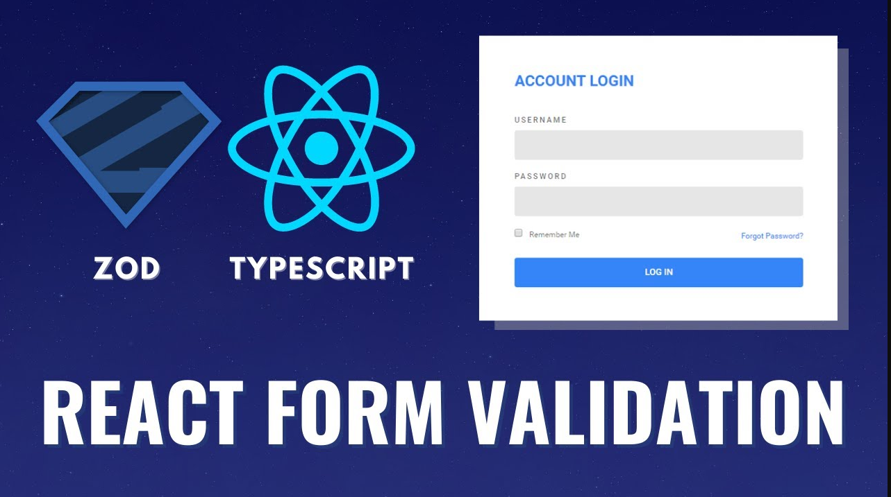

# React Hook Form with ZOD Tutorial - React and Typescript Form Validation Tutorial

https://www.youtube.com/watch?v=dldjCPa9ZW4&ab_channel=PedroTech

In this video we go over react form validation using zod and react hook form.

**Project** --> React Hook Form with ZOD Tutorial - React and Typescript Form Validation Tutorial 
**Channel** --> PedroTech 178 mil inscritos 
**Date Created** --> 14 de mar. de 2023

### npm Commands

yarn add zod react-hook-form @hookform/resolvers

### Components

-  main
-  App
-

### Libraries

-  react
-  typescript
-  hook-forms
-  zod
-  typescript

### Observations/Notes

1st - Create the form and the fields 
2nd - Defining the schema structure Object with the values & and validations 
3rd - Refine the validation schema 
4th - Define type w/ TS 
5th - Set it with the ZodType 
6th - Use Hook form to check if form matches schema 
7th - Connect hook form with the zodResolver (register, handleSubmit)

## Tags or timeStamps

REACT HOOK FORM ZOD TIMESTAMPS
00:00 | Intro 
01:51 | Introduction to the Zod Library 
02:58 | Installing Packages 
03:41 | Creating the structure of the Form 
06:30 | Defining Form Structure using Zod 
18:33 | How to display Error Messages 
